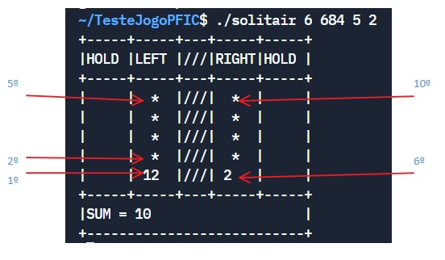

**UNIVERSIDADE LUSÓFONA DE HUMANIDADES E TECNOLOGIAS**

*Introdução à Computação - 2021/2022*

# Projecto Final - Solitair 0-21

## 1. Introdução

### 1.1 Recomendações

Na resolução deste projecto deve ser utilizada a Linguagem de Programação C. Para além da correta implementação dos requisitos, tenha em conta os seguintes aspetos:
- O código apresentado deve estar *bem indentado*. 
- O código deve compilar sem erros ou *warnings* utilizando o *gcc* com as seguintes flags:
 `-Wall -Wextra -Wpedantic -ansi`
- Para compilar o código usando a biblioteca <math.h> é necessário usar a flag de linkagem `-lm`
- Tenha em atenção os nomes dados das variáveis, para que sejam indicadores daquilo que as mesmas vão conter.
- Evite o uso de constantes mágicas. 
- Evite duplicação de código. 
- Considere a implementação de funções para melhorar a legibilidade, evitar a duplicação e criar soluções mais genéricas.
- É proíbida a utilização de variáveis globais - i.e. variáveis declaradas fora de qualquer função.
- Quando o programa deve terminar sempre retornando o valor 0. Pode faze-lo através de um `return 0` na função `main()` ou através da invocação da função `exit(0)`. Caso retorne com valor diferente de zero irá automaticamente falhar os testes na plataforma Pandora.

Para a realização deste projecto, os alunos deverão adquirir as seguintes competências:
- Manipulação de ficheiros
- Vectores e matrizes
- Strings
- Ciclos
- Condições
- Argumentos do main
- Estruturas
- Memória Dinâmica
- git

### 1.2 Descrição

Este projecto consiste no desenvolvimento do jogo Solitair 0-21 em linguagem C. O jogo consiste em conseguir virar todas as cartas que estão na mesa, no entanto a soma terá que estar sempre entre 0 e 21. O jogo apresenta o seguinte tabuleiro:
```
+-----+-----+---+-----+-----+
|HOLD |LEFT |///|RIGHT|HOLD |
+-----+-----+---+-----+-----+
|     |  *  |///|  *  |     |
|     |  *  |///|  *  |     |
|     |  *  |///|  *  |     |
|     |  *  |///|  *  |     |
|     |  *  |///|  *  |     |
|     |  *  |///|  *  |     |
|     |  *  |///|  *  |     |
|     |  *  |///|  *  |     |
|     |  *  |///|  *  |     |
|     |  *  |///|  *  |     |
|     |  *  |///|  *  |     |
|     | 2   |///| -1  |     |
+-----+-----+---+-----+-----+
|SUM = 10                   |
+---------------------------+
>
```
As colunas LEFT e RIGHT contém as cartas viradas para baixo, excepto as duas últimas que estão viradas para cima. As cartas são apenas números que podem ser positivos, negativos ou zero. O valor da soma é 10 no ínicio do jogo. Em cada jogada, o jogador escolhe a carta da coluna LEFT ou da COLUNA right. A carta é removida e o valor da carta é somado ao valor em SUM. Caso o SUM seja inferior a zero ou superior a 21, o jogo acaba e o jogador perde. O jogador ganha conseguir remover todas as cartas. No exemplo apresentado acima, se o jogador seleccionar a coluna LEFT, SUM ficará com o valor 12. A carta  com o valor '2' é removida e será revelada uma nova carta na coluna LEFT:
```
+-----+-----+---+-----+-----+
|HOLD |LEFT |///|RIGHT|HOLD |
+-----+-----+---+-----+-----+
|     |  *  |///|  *  |     |
|     |  *  |///|  *  |     |
|     |  *  |///|  *  |     |
|     |  *  |///|  *  |     |
|     |  *  |///|  *  |     |
|     |  *  |///|  *  |     |
|     |  *  |///|  *  |     |
|     |  *  |///|  *  |     |
|     |  *  |///|  *  |     |
|     |  *  |///|  *  |     |
|     | 1   |///|  *  |     |
|     |     |///| -1  |     |
+-----+-----+---+-----+-----+
|SUM = 12                   |
+---------------------------+
>
```

É possível colocar algumas cartas em reserva nas colunas HOLD. Por exemplo na seguinte situação:
```
+-----+-----+---+-----+-----+
|HOLD |LEFT |///|RIGHT|HOLD |
+-----+-----+---+-----+-----+
|     |  *  |///|  *  |     |
|     |  *  |///|  *  |     |
|     |  *  |///|  *  |     |
|     |  *  |///|  *  |     |
|     |  *  |///|  *  |     |
|     |  5  |///|  *  |     |
|     |     |///|  *  |     |
|     |     |///|  8  |     |
|     |     |///|     |     |
|     |     |///|     |     |
|     |     |///|     |     |
|     |     |///|     |     |
+-----+-----+---+-----+-----+
|SUM = 19                   |
+---------------------------+
>q
```
o jogador não pode escolher nem a coluna LEFT nem a coluna RIGHT, se o fizer perde o jogo. Em alternativa, pode transferir a carta da coluna LEFT para a coluna HOLD (left) ou a carta da coluna RIGHT para a coluna HOLD (right). No seguinte exemplo o jogador escolheu colocar a carta da coluna LEFT em HOLD.
```
+-----+-----+---+-----+-----+
|HOLD |LEFT |///|RIGHT|HOLD |
+-----+-----+---+-----+-----+
|  5  |  *  |///|  *  |     |
|     |  *  |///|  *  |     |
|     |  *  |///|  *  |     |
|     |  *  |///|  *  |     |
|     |  2  |///|  *  |     |
|     |     |///|  *  |     |
|     |     |///|  *  |     |
|     |     |///|  8  |     |
|     |     |///|     |     |
|     |     |///|     |     |
|     |     |///|     |     |
|     |     |///|     |     |
+-----+-----+---+-----+-----+
|SUM = 19                   |
+---------------------------+
>
```
No entanto, a carta que se revelou, continua a não poder ser retirada. Caso o jogador volte a colocar a carta da coluna LEFT em HOLD resultará na seguinte situação:
```
+-----+-----+---+-----+-----+
|HOLD |LEFT |///|RIGHT|HOLD |
+-----+-----+---+-----+-----+
|  5  |  *  |///|  *  |     |
|  2  |  *  |///|  *  |     |
|     |  *  |///|  *  |     |
|     | -10 |///|  *  |     |
|     |     |///|  *  |     |
|     |     |///|  *  |     |
|     |     |///|  *  |     |
|     |     |///|  8  |     |
|     |     |///|     |     |
|     |     |///|     |     |
|     |     |///|     |     |
|     |     |///|     |     |
+-----+-----+---+-----+-----+
|SUM = 19                   |
+---------------------------+
>
```
Agora o jogador poderá remover a carta da coluna LEFT e poderá também remover as cartas da coluna HOLD. Estas serão removidas pela ordem em que se apresentam na coluna (primeiro a carta com o número '2' e depois a carta com a coluna '5').

## 2 Implementação

Neste repositório encontra-se um ficheiro .c com algumas funções necessárias e com a função main. O ficheiro deverá servir de base para o desenvolvimento deste projecto.
O programa pode receber até 4 argumentos pela linha de comandos (argumentos do main), da seguinte forma:
```
./solitair <level> <seed> <n rows> <n holds>
```
onde 
   -   <seed> valor inteiro para a seed do jogo - valor por omissão: 7
   -   <level> é o nível de dificuldade do jogo - valor por omissão: 3
   -   <n rows> é o número de linhas do jogo - valor por omissão: 12
   -   <n holds> é o número de linhas disponíveis em cada coluna HOLD - valor por omissão: 2
Caso os argumentos não sejam passados pelo utilizador, deverão ser utilizados os valores por omissão. Ou seja o utilizador poderá passar apenas a seed, a seed e o level, a seed o level e o nrows ou todos os parâmetros.

O nível de dificuldade relaciona-se com o desvio padrão dos números gerados. Isso é controlado pela função fornecida `randn()`. Esta função aceita dois parâmetros: a média (que deverá ser 0) e o desvio padrão que deverá ser o nível passado pela linha de comandos.


Após o arranque do programa e verificação dos argumentos do main, é necessário gerar as cartas que irão preencher as colunas. Primeiro deverão ser geradas as  cartas da coluna LEFT e depois as cartas da coluna right. Cada carta deverá ser gerada através de uma invocação da função fornecida `randn_sat()`. *É necessário respeitar a ordem pela qual são geradas as cartas para passar os testes do Pandora*.
  
Os vectores/ou matrizes utilizados terão obrigatoriamente de ser alocados na zona de memória dinâmica. Essa alocação deverá ser feita após a leitura do número de colunas fornecido pelo utilizador ao correr o programa.
  
Se o jogador ganhar o jogo, deverá ser apresentada a mensagem `MSG_WIN`, e em seguida o programa deve terminar.
Caso perca, deverá ser apresentada a mensagem `MSG_LOSE` e em seguida o programa deve terminar.

### 2.1 Controlos
  -   As teclas `a` e `s` são usadas para seleccionar as cartas da coluna LEFT e RIGHT, respectivamente.
  -   As teclas `q` e `w` são usadas para colocar as cartas em HOLD nas colunas da esquerda e direita, respectivamente.
  -   As teclas `z` e `x` são usadas para remover as cartas das colunas HOLD esquerda e direirta, respectivamente.
  -   A tecla `e` faz com que o programa termine.

### 2.2 Detalhes de implementação
  - Atenção ao caracter '>' que indica que o programa está à espera de um input do utilizador.
  - Os números que surgem nas colunas hold, left e right podem ser impressos utilizando: `printf(" %-3d ", ...)`;
 
### 2.2 Git
Git deve ser utilizado no desenvolvimento do trabalho. Para isso os alunos devem criar um repositório **privado** no GitHub e sincronizar com a vossa cópia local do projecto. Em seguida, no GitHub, deverão ir settings->Manage Access->Add People e adicionar o professor ```parroz```. Devem sincronizar a vossa cópia local periodicamente com o repositório no GitHub (```git push```). 
 
### 2.3 Geração de números aleatórios
A geração dos números aleatórios deve ser feita invocando a função `randn_sat()`, esta função recebe 4 parâmetros: 
 -   mean - valor médio da distribuição - deve ser sempre 0 
 -   std - desvio padrão da distribuição - deve ser igual ao nível escolhido (variável `level`) 
 -   min - valor mínimo possível de ser gerado - deve ser sempre -21
 -   max - valor máximo possível de ser gerado - deve ser sempre 21

Para que os resultados possam ser comparados, a geração de números alteatórios tem que ser feita no quando o programa inicia e pela ordem especificada: primeiro são gerados os números da coluna da LEFT e depois os números da coluna RIGHT. É ainda necessário ter em consideração a ordem pela qual os números são apresentados nas respectivas colunas. A figura seguinte mostra a ordem pela qual os números são gerados, ou seja, o número marcado como 1 é o primeiro número a ser gerado (resultado da chamada à função `randn_sat()`), o 2 é o segundo número a ser gerado... etc. Os números são todos gerados utilizando dois ciclos (um para a coluna LEFT e um para a coluna RIGHT).


  
## 3 Exemplos de utilização
Em seguida apresentam-se alguns exemplos de jogos:
```
./solitair 6 684 5 2
+-----+-----+---+-----+-----+
|HOLD |LEFT |///|RIGHT|HOLD |
+-----+-----+---+-----+-----+
|     |  *  |///|  *  |     |
|     |  *  |///|  *  |     |
|     |  *  |///|  *  |     |
|     |  *  |///|  *  |     |
|     | 12  |///| 2   |     |
+-----+-----+---+-----+-----+
|SUM = 10                   |
+---------------------------+
>q
+-----+-----+---+-----+-----+
|HOLD |LEFT |///|RIGHT|HOLD |
+-----+-----+---+-----+-----+
| 12  |  *  |///|  *  |     |
|     |  *  |///|  *  |     |
|     |  *  |///|  *  |     |
|     | 6   |///|  *  |     |
|     |     |///| 2   |     |
+-----+-----+---+-----+-----+
|SUM = 10                   |
+---------------------------+
>a
+-----+-----+---+-----+-----+
|HOLD |LEFT |///|RIGHT|HOLD |
+-----+-----+---+-----+-----+
| 12  |  *  |///|  *  |     |
|     |  *  |///|  *  |     |
|     | -8  |///|  *  |     |
|     |     |///|  *  |     |
|     |     |///| 2   |     |
+-----+-----+---+-----+-----+
|SUM = 16                   |
+---------------------------+
>a
+-----+-----+---+-----+-----+
|HOLD |LEFT |///|RIGHT|HOLD |
+-----+-----+---+-----+-----+
| 12  |  *  |///|  *  |     |
|     | 0   |///|  *  |     |
|     |     |///|  *  |     |
|     |     |///|  *  |     |
|     |     |///| 2   |     |
+-----+-----+---+-----+-----+
|SUM = 8                    |
+---------------------------+
>s
+-----+-----+---+-----+-----+
|HOLD |LEFT |///|RIGHT|HOLD |
+-----+-----+---+-----+-----+
| 12  |  *  |///|  *  |     |
|     | 0   |///|  *  |     |
|     |     |///|  *  |     |
|     |     |///| -1  |     |
|     |     |///|     |     |
+-----+-----+---+-----+-----+
|SUM = 10                   |
+---------------------------+
>s
+-----+-----+---+-----+-----+
|HOLD |LEFT |///|RIGHT|HOLD |
+-----+-----+---+-----+-----+
| 12  |  *  |///|  *  |     |
|     | 0   |///|  *  |     |
|     |     |///| -2  |     |
|     |     |///|     |     |
|     |     |///|     |     |
+-----+-----+---+-----+-----+
|SUM = 9                    |
+---------------------------+
>z
+-----+-----+---+-----+-----+
|HOLD |LEFT |///|RIGHT|HOLD |
+-----+-----+---+-----+-----+
|     |  *  |///|  *  |     |
|     | 0   |///|  *  |     |
|     |     |///| -2  |     |
|     |     |///|     |     |
|     |     |///|     |     |
+-----+-----+---+-----+-----+
|SUM = 21                   |
+---------------------------+
>s
+-----+-----+---+-----+-----+
|HOLD |LEFT |///|RIGHT|HOLD |
+-----+-----+---+-----+-----+
|     |  *  |///|  *  |     |
|     | 0   |///| -2  |     |
|     |     |///|     |     |
|     |     |///|     |     |
|     |     |///|     |     |
+-----+-----+---+-----+-----+
|SUM = 19                   |
+---------------------------+
>s
+-----+-----+---+-----+-----+
|HOLD |LEFT |///|RIGHT|HOLD |
+-----+-----+---+-----+-----+
|     |  *  |///| -5  |     |
|     | 0   |///|     |     |
|     |     |///|     |     |
|     |     |///|     |     |
|     |     |///|     |     |
+-----+-----+---+-----+-----+
|SUM = 17                   |
+---------------------------+
>a
+-----+-----+---+-----+-----+
|HOLD |LEFT |///|RIGHT|HOLD |
+-----+-----+---+-----+-----+
|     | -5  |///| -5  |     |
|     |     |///|     |     |
|     |     |///|     |     |
|     |     |///|     |     |
|     |     |///|     |     |
+-----+-----+---+-----+-----+
|SUM = 17                   |
+---------------------------+
>a
+-----+-----+---+-----+-----+
|HOLD |LEFT |///|RIGHT|HOLD |
+-----+-----+---+-----+-----+
|     |     |///| -5  |     |
|     |     |///|     |     |
|     |     |///|     |     |
|     |     |///|     |     |
|     |     |///|     |     |
+-----+-----+---+-----+-----+
|SUM = 12                   |
+---------------------------+
>s
+-----+-----+---+-----+-----+
|HOLD |LEFT |///|RIGHT|HOLD |
+-----+-----+---+-----+-----+
|     |     |///|     |     |
|     |     |///|     |     |
|     |     |///|     |     |
|     |     |///|     |     |
|     |     |///|     |     |
+-----+-----+---+-----+-----+
|SUM = 7                    |
+---------------------------+
You Win! Congratulations!
```
 
  
## 4 Material a entregar

* Ficheiro `.c` com código devidamente comentado e indentado:
    - Deve implementar as funcionalidades pedidas.
    - O código deverá ser submetido na plataforma PANDORA [(2)](#ref2) até às **23:59 do dia 28 de Novembro de 2021** no *contest* **IC2021PF**.
    - A plataforma corre automaticamente uma série de testes e no fim atribui uma classificação **indicativa**. Os alunos deverão analisar o relatório emitido pela plataforma e poderão alterar o código e voltar a submeter o trabalho. Neste trabalho haverá limite de submissões.
      A plataforma não permite a entrega de trabalhos após a data e hora limite.
    - Incorrecta indentação do código poderá originar penalizações na nota.
    - **Em cada submissão no pandora deverão incluir o link para o repositório no GitHub na linha de comentário (da plataforma)**

## 5 Peso na avaliação

O projecto vale 25% da nota final e será cotado de 0 a 20 valores.

Após a entrega do projecto será realizada uma defesa do projecto onde alterações ao código serão pedidas. Se o aluno não conseguir efectuar as alterações pedidas ao seu código será aplicada uma penalização sobre a nota do projecto que poderá variar entre 10% a 100%.

## 6 Honestidade Académica

Nesta disciplina, espera-se que cada aluno siga os mais altos padrões de honestidade académica. Trabalhos que sejam identificados como cópias serão anulados e os alunos envolvidos terão nota zero - quer tenham copiado, quer tenham deixado copiar.
Para evitar situações deste género, recomendamos aos alunos que nunca partilhem ou mostrem o seu código.
A decisão sobre se um trabalho é uma cópia cabe exclusivamente aos docentes da unidade curricular.
Os alunos são encorajados a discutir os problemas com outros alunos mas não deverão, no entanto, copiar códigos ou documentação de outros alunos. Em nenhuma circunstância deverão partilhar os seus próprios códigos, documentação e relatórios. De facto, não devem sequer deixar códigos, documentação e relatórios em computadores de uso partilhado.

## Referências

<a name="ref1"></a>

* (1) Pereira, A. (2017). C e Algoritmos, 2ª edição. Sílabo.

<a name="ref2"></a>

* (2)  PANDORA - Yet Another Automated Assessment Tool, https://saturn.ulusofona.pt/.

<a name="ref3"></a>

* (3)  Lusófona Moodle, https://secure.grupolusofona.pt/ulht/moodle/

## Metadados

* Autor: [Pedro Serra]
* Curso:  [Licenciatura em Videojogos]
* Instituição: [Universidade Lusófona de Humanidades e Tecnologias][ULHT]
